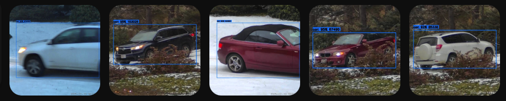
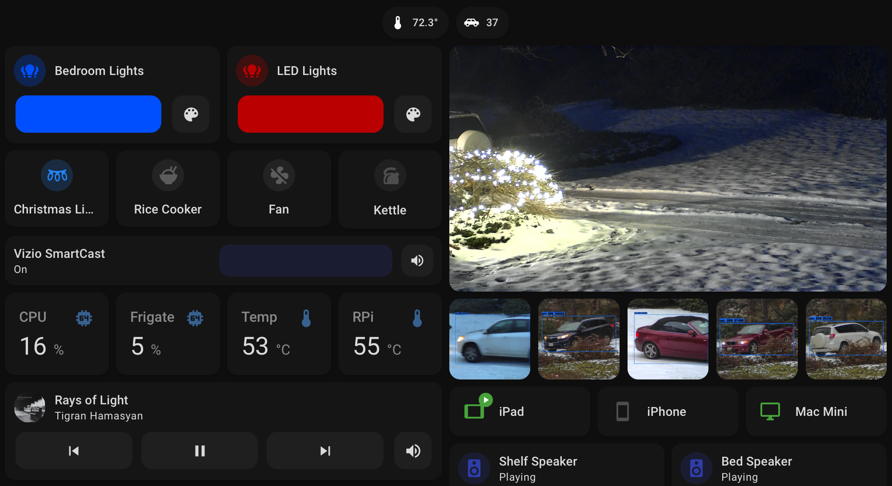
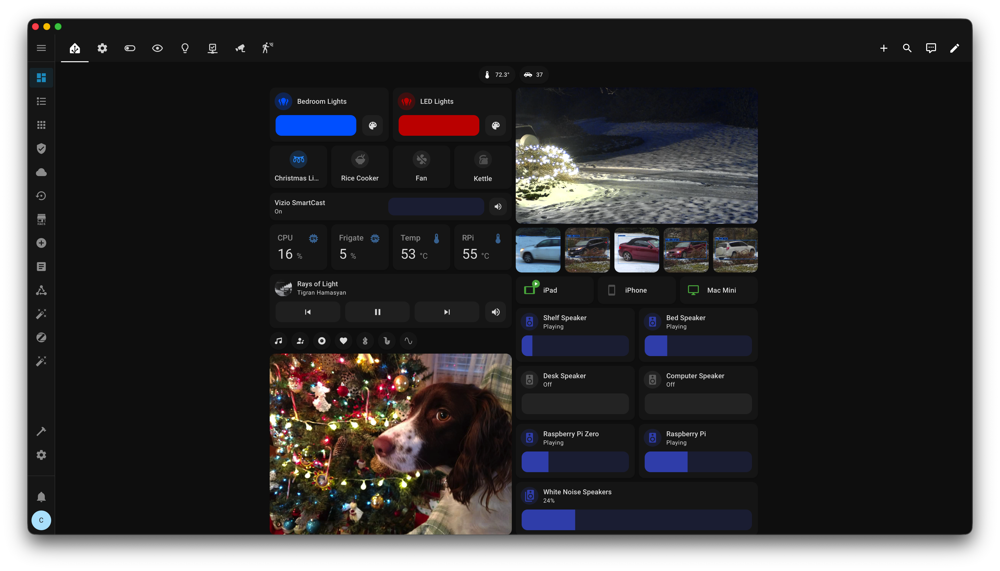
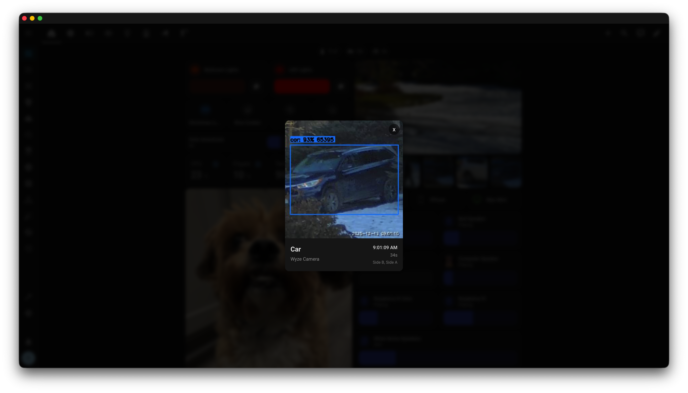

# Frigate Events Card

A simple Lovelace card for displaying recent Frigate detection events in a horizontal gallery 






## Features

- **Fast & Lightweight**: Minified and optimized for quick loading
- **Live Updates**: Instantly shows new events via WebSocket
- **Responsive**: Auto-adjusting grid layout that works great on mobile
- **Rich Media**: High-quality snapshots with optional zooming
- **Daily Reset**: Optional automated clearing for a fresh daily view
- **Interactive**: Detailed modal view with full event information

## Installation

### HACS (Recommended)

1. Open HACS in Home Assistant
2. Click the ⋮ menu → **Custom repositories**
3. Add `https://github.com/saihgupr/frigate-events-card` with category **Lovelace**
4. Search for "Frigate Events Card" and install
5. Restart Home Assistant
6. Add the card to your dashboard

### Manual Installation

1. Download `frigate-events-card.js` from the [latest release](https://github.com/saihgupr/frigate-events-card/releases)
2. Copy it to your Home Assistant `www/` folder
3. Add the resource in your Lovelace dashboard:
   ```yaml
   resources:
     - url: /local/frigate-events-card.js
       type: module
   ```
4. Add the card to your dashboard

## Usage

```yaml
type: custom:frigate-events-card
frigate_client_id: frigate
event_count: 5

# Optional filters
cameras:
  - wyze_camera
labels:
  - person
  - car
zones:
  - front_a
  - front_b

# Optional: Reset display daily at a specific time (24hr format)
daily_clear_time: "04:00"
```

## Configuration Options

| Option | Type | Default | Description |
|--------|------|---------|-------------|
| `frigate_client_id` | string | `frigate` | Your Frigate instance ID |
| `event_count` | number | `5` | Number of events to display |
| `title` | string | `Frigate Events` | Card title |
| `cameras` | list | all | Filter to specific cameras |
| `labels` | list | all | Filter to specific labels (person, car, etc.) |
| `zones` | list | all | Filter to specific Frigate zones |
| `show_label` | boolean | `true` | Show detection label |
| `show_timestamp` | boolean | `true` | Show event time |
| `show_camera` | boolean | `false` | Show camera name |
| `daily_clear_time` | string | none | Optional. Time to reset the display daily (24hr format, e.g., "04:00"). If set, events before this time are hidden and shown as grey placeholders. If omitted, no daily reset occurs. |

## Requirements

- Home Assistant with [Frigate Integration](https://github.com/blakeblackshear/frigate-hass-integration) installed
- Frigate NVR with cameras configured

## License

MIT
